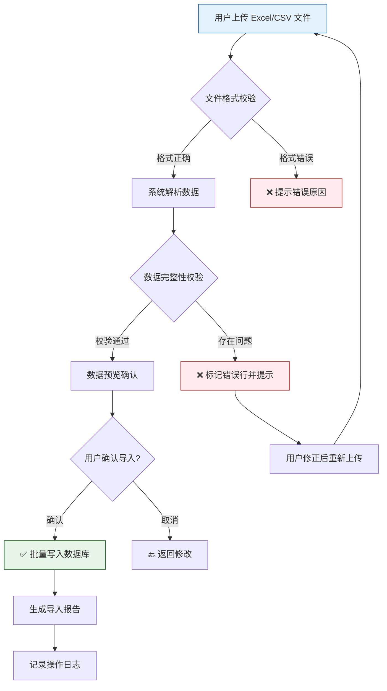
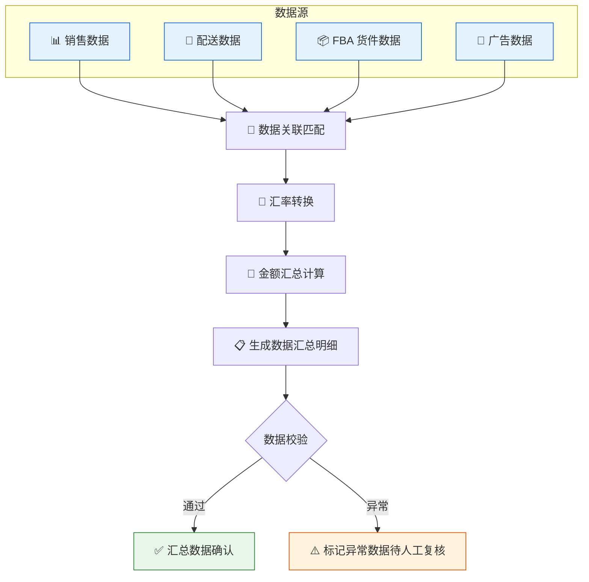
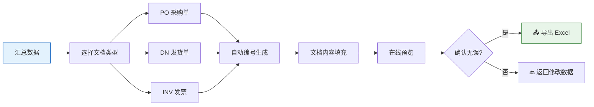
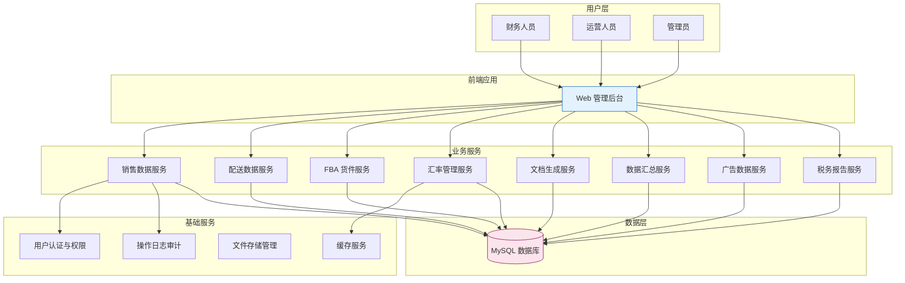
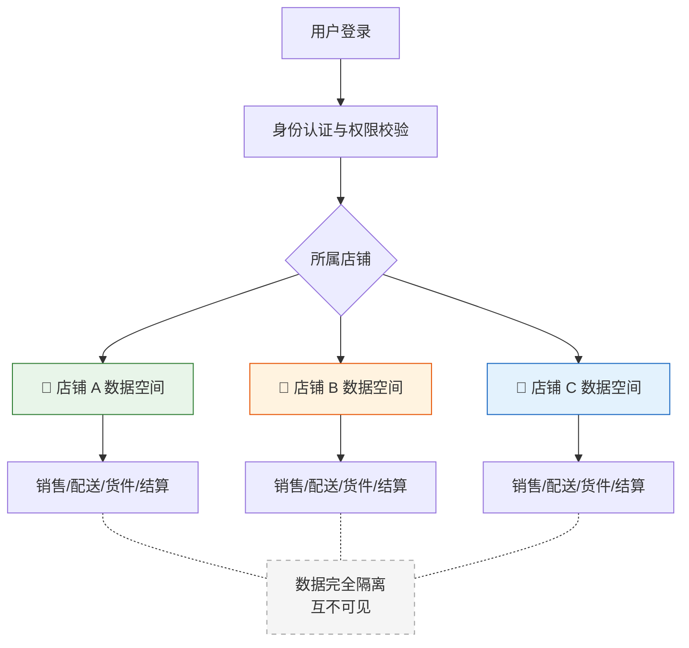

# 慕声报税管理系统

### 让跨境电商报税从此简单、准确、高效

---

## 我们是谁

慕声报税管理系统是一套面向跨境电商企业的税务管理系统，核心解决的是亚马逊 FBA（Fulfillment by Amazon）转口贸易场景下，从数据采集、整合、计算到报税文档生成的全链路管理问题。

---

## 政策背景：跨境电商税务合规已成刚需

2025 年，中国对跨境电商税务监管进入了全新阶段，多项重磅政策密集落地：

**《互联网平台企业涉税信息报送规定》（国务院令第 810 号）正式实施**
国务院发布该规定，明确要求互联网平台企业（包括境外平台）向中国税务机关报送平台经营者的涉税信息。这意味着跨境电商卖家的经营数据将被系统性地纳入国内税务监管体系。

**国家税务总局 2025 年第 15 号公告落地执行**
2025 年 6 月，国家税务总局发布配套公告，细化了平台企业报送涉税信息的具体要求和操作规范，为政策执行提供了明确指引。

**亚马逊正式启动向中国税务机关报送卖家数据**
2025 年 10 月 13 日，亚马逊发布通知，宣布将按季度向中国税务机关报送中国卖家的身份信息、交易数量与金额、销售收入、平台费用（佣金、FBA 费用等）。首次报送覆盖 2025 年第三季度数据，此后持续进行季度报送。该政策适用于在亚马逊全球任一站点（美国、欧洲、日本等）销售的所有中国卖家。

**这意味着什么？**

过去，跨境电商卖家的海外经营数据与国内税务系统之间存在信息壁垒，部分卖家的税务申报可能不够规范。如今，这道壁垒正在被彻底打破——税务机关将直接获取平台交易数据，卖家申报的收入、费用必须与平台数据一致。税务合规已从"建议"变为"必须"，不合规将面临补税、滞纳金甚至处罚的风险。

> 政策信息来源：[国务院令第 810 号](https://www.10100.com/article/30447380)、[国家税务总局 2025 年第 15 号公告](https://www.hendersen.com/trends/1)
>
> *以上政策内容为概括性描述，具体条款请以官方发布的原文为准。*

---

## 行业痛点

转口贸易是亚马逊跨境电商的主流运营模式，但在向国内自主报税这个环节，整个行业面临着巨大的困境：

**平台计算逻辑不清晰，商户无从下手**
亚马逊平台提供的销售报表、配送报表、结算报表各自独立，数据口径不统一，计算规则也不透明。商户拿到一堆原始数据，根本不知道如何关联、如何计算、如何整理成税局要求的格式。很多商户甚至不清楚哪些数据需要报、怎么报。

**财务公司面对海量数据同样头痛**
即便委托专业财务公司处理，面对一个季度上万条销售记录、配送记录、多币种结算数据，人工整理和核算的工作量依然巨大。数据散落在不同报表中，需要反复下载、比对、换算、关联，一个客户的数据处理可能就要耗费数天，效率极低且容易出错。

**复杂逻辑缺乏标准化，全靠经验和手工**
从销售数据到最终的报税文档，中间涉及多源数据关联、多币种汇率转换、金额汇总计算、文档编号生成等一系列复杂逻辑。这些逻辑目前没有标准化的处理方式，全靠财务人员的经验和手工操作，不同人处理结果可能不一致，数据准确性难以保障。

**报税文档制作繁琐，格式要求严格**
PO（采购单）、DN（发货单）、INV（发票）、结算单等报税文档，格式要求严格，编号规则复杂。手工制作不仅效率低，还容易出现格式错误、编号重复、数据遗漏等问题。

**多店铺管理混乱**
运营多个亚马逊店铺时，各店铺数据容易混淆，权限管理困难，数据安全难以保障。

---

## 我们的核心价值

**把复杂的报税逻辑标准化，用系统替代人工核算和文档输出。**

我们深入研究了亚马逊转口贸易报税的全部业务逻辑，将散落在各处的计算规则、数据关联关系、文档生成规范梳理清楚，固化到系统中。无论是商户自主报税，还是财务公司代理报税，都可以通过系统完成从原始数据到报税文档的全流程处理，不再依赖人工经验，不再担心计算错误。

---

## 业务流程总览

> 从亚马逊平台获取原始数据，到最终生成报税文档提交税局，全流程在系统内完成。

---

## 数据导入流程

---

## 数据整理与汇总流程

---

## 报税文档生成流程

---

## 系统架构概览

---

## 多店铺数据隔离模型

---

## 我们如何解决

### 一、一键导入，多源数据自动整合

支持 Excel、CSV 等多种格式的批量数据导入，自动识别亚马逊原始数据格式。销售数据、配送数据、FBA 货件数据、广告账单，一次导入，系统自动解析、校验、关联，告别手工整理的繁琐。

- 单次支持导入 10,000+ 条数据
- 导入前自动校验数据格式和完整性
- 重复数据智能检测与提示
- 原始文件自动备份，随时可追溯

### 二、智能汇率管理

内置多币种汇率管理模块，支持从外部数据源自动同步最新汇率，本地缓存确保查询速度。所有涉及金额的计算自动完成币种转换，消除人工换算误差。

### 三、业务数据智能汇总

系统自动将销售数据、配送数据、FBA 货件数据进行关联匹配和汇总计算，辅助财务人员快速整理出清晰的数据明细。最终的结算单据和发票仍以真实业务单据为准，系统提供的是高效的数据整理和核对工具，帮助用户大幅减少手工整理的工作量。

### 四、报税文档一键生成

根据业务数据自动生成符合格式要求的报税文档：

| 文档类型 | 说明 |
|---------|------|
| PO（采购单） | 基于真实采购数据生成，编号规则自动管理 |
| DN（发货单） | 基于真实配送数据生成发货单据 |
| INV（发票） | 基于真实交易数据汇总生成，格式规范 |

所有文档支持在线预览和 Excel 导出。最终提交税局的单据应以真实业务凭证为依据，系统生成的文档作为高效的制单工具，确保格式规范、数据一致。

### 五、多店铺独立管理

每个亚马逊店铺的数据完全隔离，互不干扰。基于角色的权限控制，确保不同人员只能访问授权范围内的数据，兼顾管理灵活性与数据安全。

### 六、全程可追溯

每一次数据导入、修改、文档生成都有完整的操作日志记录。谁在什么时间做了什么操作，一目了然。面对税局审查，所有数据来源和变更历史都能清晰追溯。

---

## 使用我们的系统，您将获得

**⏱️ 效率提升**
- 数据处理时间从数天缩短到数小时
- 报税文档生成从手工制作变为一键生成
- 1,000 条数据的导入和校验在 30 秒内完成

**✅ 准确性保障**
- 系统自动校验消除人工录入错误
- 汇率自动同步避免换算偏差
- 数据关联由系统完成，杜绝遗漏和错配

**🔒 合规与安全**
- 完整的操作日志满足税务审计要求
- 原始数据备份确保数据可追溯
- 多店铺数据隔离保障数据安全
- 基于角色的权限控制防止越权操作

**📊 管理可视化**
- 销售数据、配送数据、结算数据一目了然
- 税务报告自动汇总，辅助经营决策
- 图表化展示关键业务指标

**💰 成本节约**
- 减少财务人员重复性工作，释放人力
- 降低因数据错误导致的税务风险和罚款
- 避免因报税延误产生的滞纳金

---

## 核心功能一览

| 功能模块 | 核心能力 |
|---------|---------|
| 销售数据管理 | 多格式导入、智能解析、查询导出、数据统计 |
| 配送数据管理 | FBA 配送数据管理、多渠道支持、站点编码自动解析 |
| FBA 货件管理 | 货件信息管理、Excel 批量导入、数据校验 |
| 汇率管理 | 多币种支持、自动同步、本地缓存、历史汇率查询 |
| 文档生成 | PO/DN/INV 文档自动生成、在线预览、Excel 导出 |
| 数据汇总 | 多源数据自动关联、金额汇总计算、明细导出 |
| 广告数据管理 | 广告账单导入、费用统计 |
| 税务报告 | 汇总报告生成、多维度统计分析 |
| 系统管理 | 用户管理、角色权限、操作日志、数据审计 |

---

## 适用客户

- 在亚马逊平台开展转口贸易的跨境电商企业
- 运营多个亚马逊店铺、涉及多国市场的卖家
- 需要定期向税局提交报税材料的贸易公司
- 希望提升财务效率、降低税务风险的企业

---

## 技术优势

- 前后端分离架构，响应速度快，用户体验流畅
- 企业级安全认证，数据传输加密
- 支持大批量数据处理，单次导入万级数据无压力
- 模块化设计，可根据业务需求灵活扩展
- 完善的 API 文档，支持与企业现有系统对接

---

> **慕声报税管理系统 — 让数据说话，让报税无忧。**
>
> 把时间花在业务增长上，报税的事交给我们。
